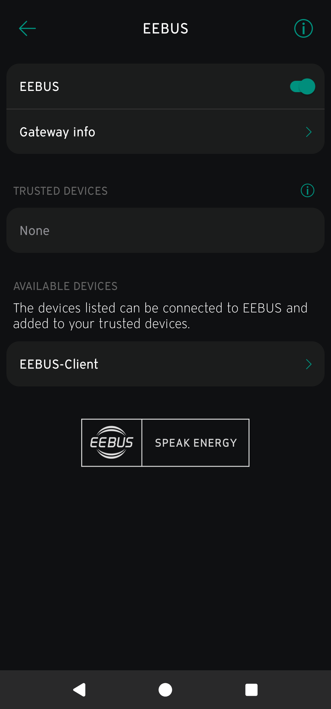
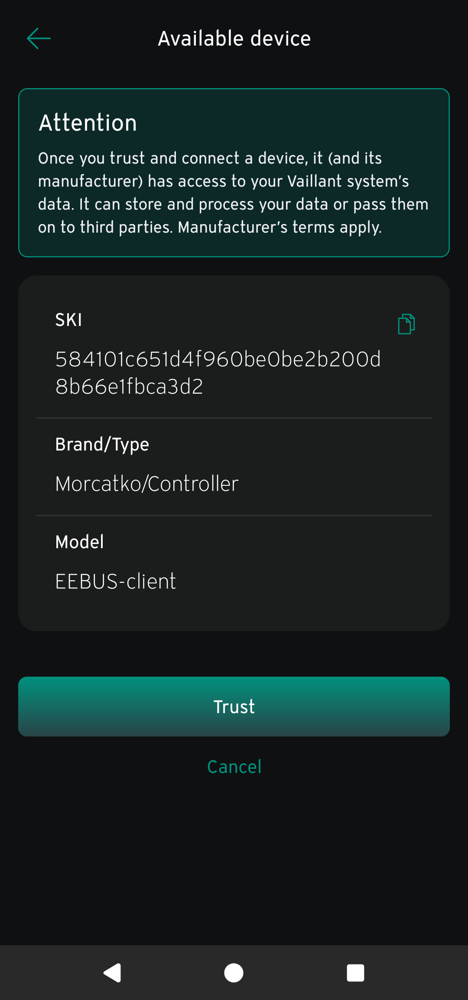
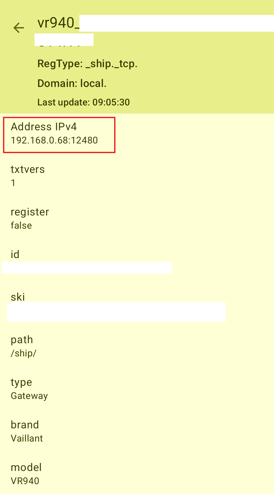

# Initial Setup

This guide will walk you through setting up your client to connect to an EEBUS-compatible device.

## Prerequisites

Before you begin, ensure you have the following installed:

- **Node.js and npm**: For running the TypeScript client application.
- **.NET SDK**: Only required if you want to generate your own client certificate (Option 1b).
- **mDNS Browser Tool**: To discover your EEBUS device on the network.
    - **Windows**: mDNS-Browser
    - **Android**: Service Browser (available on the Play Store)

---

## 1. Client Certificate

Your client needs a certificate to authenticate with the EEBUS server. You have two options:

### Option A: Use the Provided Certificate (Easier)

If you use the pre-packaged certificate, no action is needed for this step. This is the simplest method, but less secure than generating your own.

### Option B: Generate Your Own Certificate (More Secure)

To generate a unique certificate for your client, follow these steps:

1.  Navigate to the .NET project directory: `./dotnet/eebus/`.
2.  Open the `program.cs` file in a text editor.
3.  On line 21, change the value of the `id` variable to a unique identifier for your client.
4.  Run the .NET application to generate the certificate file (`cert.pfx`).
5.  Copy the newly generated `cert.pfx` file to `ts/src/cert.pfx`, overwriting the existing file.
6.  Update the following values in your TypeScript configuration (likely at the top of `ts/src/index.ts`) to match your new certificate:
    - `device_Id`
    - `cert_SKI`
    - `cert_FileName`

---

## 2. Pair Devices

For the EEBUS server to accept connections from your client, the client must be "trusted". This process uses mDNS for discovery and pairing.

The following example is for a **Vaillant Heat Pump with a vr940 gateway**. The process should be similar for other devices.

1.  Open `ts/src/index.ts` in your editor.
2.  Modify the end of the file to enable mDNS discovery mode:
```typescript
mdns();
//readData();
```

and run the app (`npm start`). You will see `mDNS started`

### The following process works for Vaillant Heat Pump with vr940 gateway
- Open your official app
- Go to settings -> Network settings -> EEBUS
- Turn it on
- Wait a while for `EEBUS-Client` to appear in Available devices
- Click on it and click on `Trust` button
- Check that the client is now in Trusted devices section




Tips:
 - Sometimes the EEBUS/mDNS freezes in vaillant so try turning EEBUS off and on again
 - You might need to disable firewall on your PC (can be turned on after the client is trusted)
 - Usefull tools for debugging
   - windows - https://github.com/hrzlgnm/mdns-browser
   - android - Service Browser

# 3. Device IP and Port
To get the device port you need to use any 3rd party nDNS client (Check one of the tools listed in previous step)
- look for `_ship_.tcp` services
- Check IP address



- update `ts/src/index.ts`
```
const target_IP = "192.168.0.68";
const target_PORT = 12480;
```
At the end of a file change
```
//mdns();
readData();
```


# 4. Connecting to device
run the app
- go to `./ts` folder
- run `npm start`
- It will try to connect to your device.

If you get `phase: "pending"` then your server probably does not trust your client. Verify step 2 
```
<<= x01
{"connectionHello":{"phase":"pending","waiting":60000}}
```

If everything works you should see communications logs and mainly `Discovery Data` which shows eveyrthing your device can do
```
======== Discovery Data =========
...
...
=================================
```

Once you are done continue to [How to use the code](/docs/usage.md)